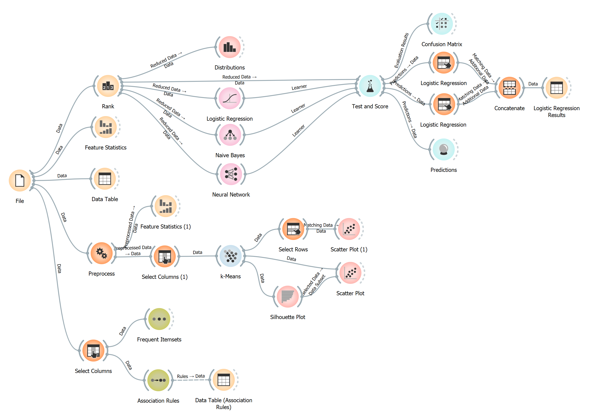

# trabalhoIA_G10 - LESI - IPCA

Projeto desenvolvido para a disciplina de Inteligência Artificial.

Esta disciplina faz parte do terceiro ano curricular da Licenciatura em Engenharia de Sistemas Informáticos.

## Colaboradores

Este trabalho contou com a colaboração dos seguintes alunos:

- 6160 - Renato Dantas
- 6149 - Benjamin Diogo

## Contextualização do Trabalho

O objetivo deste projeto, é implementar e analisar aproximações distintas de Machine Learning (ML) e métodos para tratar um problema especifico utilizando um dataset público.

Este projeto deverá de usar um dataset único para classificação, clustering e regras de associação.

## Execução do Projeto

